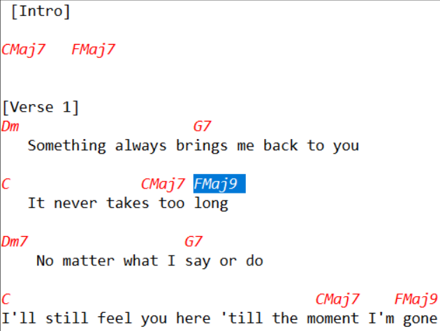
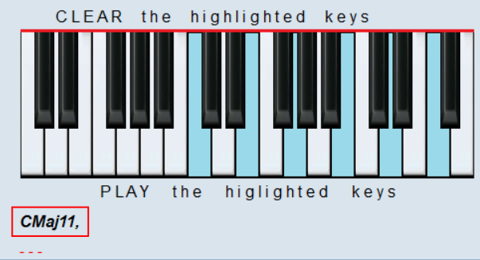
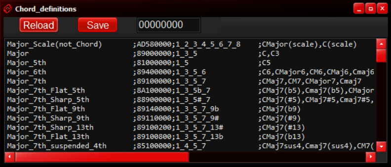
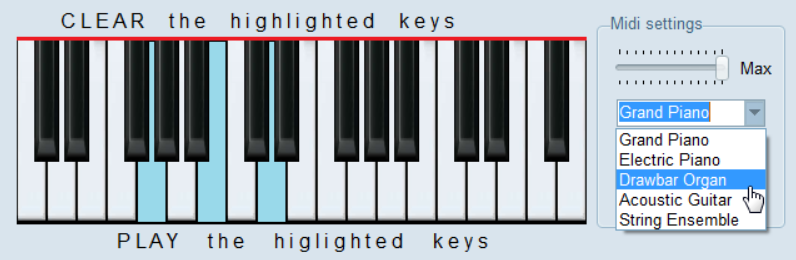
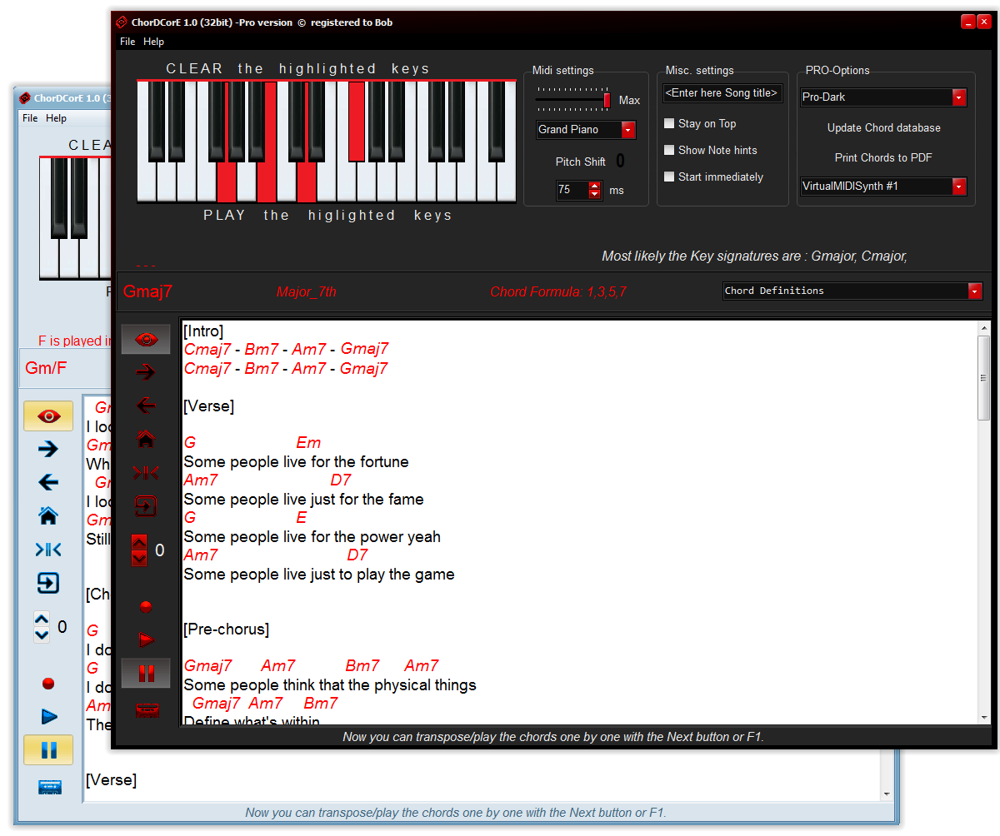
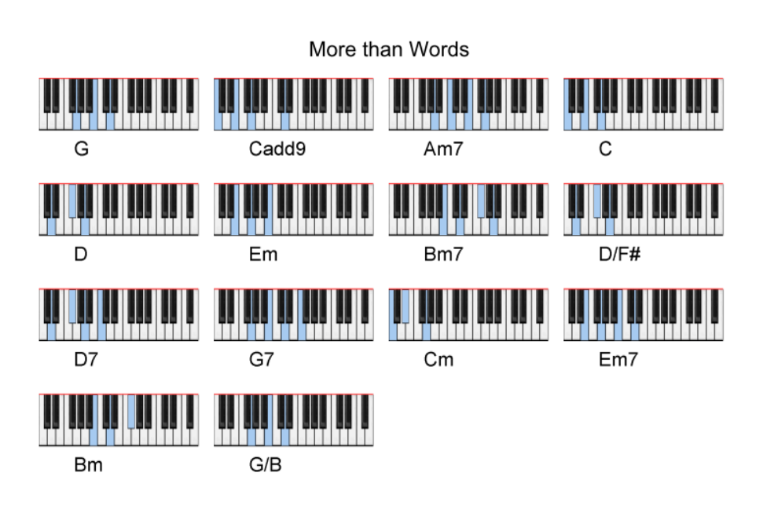

# Interpret, Progress and Transpose chords with ChordCore

ChordCore is a free piano education software for beginners who are just starting to learn the first chords, and experts who aim to broaden their knowledge or just exercise. The main purpose of the software is to provide a fast and graphical way to interpret the chords for music. These days the internet is full of openly available chord/lyrics texts for most songs. The majority of these texts are mainly for the support of guitar players by showing them the correct guitar tabs. ChordCore can decode these texts on a built-in virtual piano keyboard, with the added choice to explore chord progressions. It is possible to record, playback and even save the tempo of chord changes which helps with learning complex music. With a few clicks, you can correct, improve or transpose the chords using the built-in chord definitions. ChordCore can interpret all known chord types and alternate chord symbols, but in case of personal needs, the database is easily updatable.
<p align="center"><iframe width="560" height="315" src="https://www.youtube-nocookie.com/embed/fklbXvDouDs" title="ChordCore Trailer" frameborder="0" allow="accelerometer; autoplay; clipboard-write; encrypted-media; gyroscope; picture-in-picture" allowfullscreen></iframe></p>


### For Beginners

You will learn how to play chords easily without the knowledge of reading sheet music. You will learn how to build and play major, minor, seventh, augmented, diminished, suspended, extended chords on the piano. You will learn how to use chord formulas and their benefits. One of the tool’s capabilities is the reverse chord finder to find chord names that have a specific set of notes. By using a built-in virtual piano or dynamic text editor, the chords can be played with one out of five selectable MIDI instruments. It is possible to use high-quality sound fonts instead of general MIDI instruments to reach professional, studio-level sounding. You can even connect and pair your external MIDI Keyboard to ChordCore for improved comfort. Finally, you can export the used chords chart to PDF document.


### For Professionals

With ChordCore you can write down the lyrics and chords of your song to achieve the wished chord progression. You can explore the set of extended chords common in jazz, funk, and R&B. If you are a musician but not familiar with chord symbol interpretation, ChordCore can help you with this too. Even singers can find ChordCore useful by having straight chord accompaniment in the best possible key.

## Features

<p align="center"><iframe width="560" height="315" src="https://www.youtube-nocookie.com/embed/v5sAmU-on6A" title="YouTube video player" frameborder="0" allow="accelerometer; autoplay; clipboard-write; encrypted-media; gyroscope; picture-in-picture" allowfullscreen></iframe></p>

### Interpret and Play chords 
[Interpret and play](https://youtu.be/6CJ0cuDuLCA?t=13){:target="_blank"} chord symbols by copying them to ChordCore’s text editor or by [Opening them as files](https://youtu.be/aBfuHEeym34){:target="_blank"} </br>


### Over 80 built-in chord types 
The database includes the most commonly used chord symbols for more than 80 chord types
All Pre-Defined ChordCore Chords:
```markdown
C C3 C5 C6 CMajor6 CM6 CMaj6 Cmaj6 CMaj7 CM7 CMajor7 Cmaj7 CMaj7(b5) Cmaj7(b5) CMajor7(b5) CM7(b5) CM7b5 CMaj7(#5) CMaj7#5 Cmaj7#5 Cmaj7(#5) C+Maj7 CMaj7(b9) CMaj7(#9) CMaj7(#13) CMaj7(b13) CMaj7sus4 Cmaj7(sus4) CM7(sus4) CMaj7sus CMaj9 CM9 CMaj7(add9) CM7(add9) CMajor7(add9) CM7/9 CMaj7/9 Cmaj9 CMa9 CMaj9(#11) Cmaj9(#11) CMajor9(#11) CMaj11 CM11 Cmaj11 CMajor11 Cmaj7(add11) CMaj7(add11) CM7(add11) Cmaj7add11 CMaj7add11 CMaj13 CM13 CMaj7(add13) CM(add13) CM7(add6) Cmaj7add13 CMaj7add13 CMaj13(b5) CMaj13(#5) CMaj13(b9) CMaj13b9 CM13(b9) CM13b9 CMaj13(#9) CMaj13#9 CM13(#9) CM13#9 CMaj13(#11) CMaj13#11 Cmaj13#11 Cmaj13(#11) Cm Cmin Cmi C- Cm6 Cminor6 Cmin6 C-6 Cm(b6) Cm7 Cminor7 C-7 Cmin7 Cm7(b5) Cm7b5 Cm7-5 Cm7(-5) C1/2dim7 C1/2dim Cmin7b5 Cmin7(b5) Cm7(#5) Cm7(+5) Cm7+5 Cm7#5 Cm7aug5 Cm7(aug5) C+m7 Cm7(b9) Cm7b9 Cm-9 Cm7(#11) Cm7#11 Cm11+ Cm9 C-9 Cminor9 Cmin9 Cm7/9 Cm7(add9) C-7/9 C-7(add9) Cmin7/9 Cmin7(add9) Cm9(b5) Cm11 C-11 Cminor11 Cmin11 Cm7/11 Cm7(add11) C-7(add11) C-7/11 Cmin7/11 Cm11(b5) Cm11(b13) Cm11(b9b13) Cm13 Cminor13 Cmin13 C-13 Cmin7(add13) Cm7(add13) Cm7/13 C-7/13 Cmin7/13 Cm13(#11) Cm13#11 Cm(Maj7) Cm(maj7) Cm(+7) Cm(M7) Cmin(Maj7) C-(M7) Cm(addM7) Cm(add7) Cmin(addM7) Cmin(+7) Cmin(add7) Cm(#7) CmM7 Cm(Maj7#5) Cm(Maj7b5) Cm9(Maj7) Cm(add9) C7 Cdom Cdom7 C7th C7(b5) C7(-5) C7b5 C7-5 C7(#5) C7+5 C7(+5) C7#5 C+7 Caug7 C7+ C7(b9) C7-9 C7(-9) C7b9 C7(addb9) C-9 C7(#9) C7+9 C7(+9) C7#9 C9+ C7aug9 C7(#5b9) C7(b5b9) C7(#5#9) C7(#11) C7#11 C7(+11) C11+ C7aug11 C7(add11) C7add11 C7(add13) C7add13 Cadd13 C(add13) C7(add6) C7sus4 C7sus C7sus2 C9sus2 C9 C7(add9) C7add9 C7/9 C9(b5) C9(-5) C9-5 C9b5 C7/9(b5) C9(#5) C9#5 C+9 Caug9 C7#5(add9) C9(#11) C9aug11 C9#11 C9(aug11) C9sus C9sus4 C11 Cdom11 C13 C13(b9) C13b9 C13(#9) C13#9 C13(#5b9) C13#5b9 C13(b5b9) C13b5b9 C13(#11) C13#11 Cdim Cdim7 Cdim/6 Cdim(add6) Caug C+ C(#5) C+5 C7/6 C(7/6) Csus2 C2 Csus Csus4 C4 C(#3) C(add4) Cadd4 Csus24 Csus42 C(b5) C-5 C6/9 C69 C6(add9) CMaj6(add9) CM6(add9) C9/6 C6add9 C6/9(#11) Cm6/9 Cm9/6 Cadd2 Cadd(2) Cadd9 Cadd(9) C(add9) C(add2) C6sus C6sus4 C# C#3 C#5 C#6 C#Major6 C#M6 C#Maj6 C#maj6 C#Maj7 C#M7 C#Major7 C#maj7 C#Maj7(b5) C#maj7(b5) C#Major7(b5) C#M7(b5) C#M7b5 C#Maj7(#5) C#Maj7#5 C#maj7#5 C#maj7(#5) C#+Maj7 C#Maj7(b9) C#Maj7(#9) C#Maj7(#13) C#Maj7(b13) C#Maj7sus4 C#maj7(sus4) C#M7(sus4) C#Maj7sus C#Maj9 C#M9 C#Maj7(add9) C#M7(add9) C#Major7(add9) C#M7/9 C#Maj7/9 C#maj9 C#Ma9 C#Maj9(#11) C#maj9(#11) C#Major9(#11) C#Maj11 C#M11 C#maj11 C#Major11 C#maj7(add11) C#Maj7(add11) C#M7(add11) C#maj7add11 C#Maj7add11 C#Maj13 C#M13 C#Maj7(add13) C#M(add13) C#M7(add6) C#maj7add13 C#Maj7add13 C#Maj13(b5) C#Maj13(#5) C#Maj13(b9) C#Maj13b9 C#M13(b9) C#M13b9 C#Maj13(#9) C#Maj13#9 C#M13(#9) C#M13#9 C#Maj13(#11) C#Maj13#11 C#maj13#11 C#maj13(#11) C#m C#min C#mi C#- C#m6 C#minor6 C#min6 C#-6 C#m(b6) C#m7 C#minor7 C#-7 C#min7 C#m7(b5) C#m7b5 C#m7-5 C#m7(-5) C#1/2dim7 C#1/2dim C#min7b5 C#min7(b5) C#m7(#5) C#m7(+5) C#m7+5 C#m7#5 C#m7aug5 C#m7(aug5) C#+m7 C#m7(b9) C#m7b9 C#m-9 C#m7(#11) C#m7#11 C#m11+ C#m9 C#-9 C#minor9 C#min9 C#m7/9 C#m7(add9) C#-7/9 C#-7(add9) C#min7/9 C#min7(add9) C#m9(b5) C#m11 C#-11 C#minor11 C#min11 C#m7/11 C#m7(add11) C#-7(add11) C#-7/11 C#min7/11 C#m11(b5) C#m11(b13) C#m11(b9b13) C#m13 C#minor13 C#min13 C#-13 C#min7(add13) C#m7(add13) C#m7/13 C#-7/13 C#min7/13 C#m13(#11) C#m13#11 C#m(Maj7) C#m(maj7) C#m(+7) C#m(M7) C#min(Maj7) C#-(M7) C#m(addM7) C#m(add7) C#min(addM7) C#min(+7) C#min(add7) C#m(#7) C#mM7 C#m(Maj7#5) C#m(Maj7b5) C#m9(Maj7) C#m(add9) C#7 C#dom C#dom7 C#7th C#7(b5) C#7(-5) C#7b5 C#7-5 C#7(#5) C#7+5 C#7(+5) C#7#5 C#+7 C#aug7 C#7+ C#7(b9) C#7-9 C#7(-9) C#7b9 C#7(addb9) C#-9 C#7(#9) C#7+9 C#7(+9) C#7#9 C#9+ C#7aug9 C#7(#5b9) C#7(b5b9) C#7(#5#9) C#7(#11) C#7#11 C#7(+11) C#11+ C#7aug11 C#7(add11) C#7add11 C#7(add13) C#7add13 C#add13 C#(add13) C#7(add6) C#7sus4 C#7sus C#7sus2 C#9sus2 C#9 C#7(add9) C#7add9 C#7/9 C#9(b5) C#9(-5) C#9-5 C#9b5 C#7/9(b5) C#9(#5) C#9#5 C#+9 C#aug9 C#7#5(add9) C#9(#11) C#9aug11 C#9#11 C#9(aug11) C#9sus C#9sus4 C#11 C#dom11 C#13 C#13(b9) C#13b9 C#13(#9) C#13#9 C#13(#5b9) C#13#5b9 C#13(b5b9) C#13b5b9 C#13(#11) C#13#11 C#dim C#dim7 C#dim/6 C#dim(add6) C#aug C#+ C#(#5) C#+5 C#7/6 C#(7/6) C#sus2 C#2 C#sus C#sus4 C#4 C#(#3) C#(add4) C#add4 C#sus24 C#sus42 C#(b5) C#-5 C#6/9 C#69 C#6(add9) C#Maj6(add9) C#M6(add9) C#9/6 C#6add9 C#6/9(#11) C#m6/9 C#m9/6 C#add2 C#add(2) C#add9 C#add(9) C#(add9) C#(add2) C#6sus C#6sus4 
D D3 D5 D6 DMajor6 DM6 DMaj6 Dmaj6 DMaj7 DM7 DMajor7 Dmaj7 DMaj7(b5) Dmaj7(b5) DMajor7(b5) DM7(b5) DM7b5 DMaj7(#5) DMaj7#5 Dmaj7#5 Dmaj7(#5) D+Maj7 DMaj7(b9) DMaj7(#9) DMaj7(#13) DMaj7(b13) DMaj7sus4 Dmaj7(sus4) DM7(sus4) DMaj7sus DMaj9 DM9 DMaj7(add9) DM7(add9) DMajor7(add9) DM7/9 DMaj7/9 Dmaj9 DMa9 DMaj9(#11) Dmaj9(#11) DMajor9(#11) DMaj11 DM11 Dmaj11 DMajor11 Dmaj7(add11) DMaj7(add11) DM7(add11) Dmaj7add11 DMaj7add11 DMaj13 DM13 DMaj7(add13) DM(add13) DM7(add6) Dmaj7add13 DMaj7add13 DMaj13(b5) DMaj13(#5) DMaj13(b9) DMaj13b9 DM13(b9) DM13b9 DMaj13(#9) DMaj13#9 DM13(#9) DM13#9 DMaj13(#11) DMaj13#11 Dmaj13#11 Dmaj13(#11) Dm Dmin Dmi D- Dm6 Dminor6 Dmin6 D-6 Dm(b6) Dm7 Dminor7 D-7 Dmin7 Dm7(b5) Dm7b5 Dm7-5 Dm7(-5) D1/2dim7 D1/2dim Dmin7b5 Dmin7(b5) Dm7(#5) Dm7(+5) Dm7+5 Dm7#5 Dm7aug5 Dm7(aug5) D+m7 Dm7(b9) Dm7b9 Dm-9 Dm7(#11) Dm7#11 Dm11+ Dm9 D-9 Dminor9 Dmin9 Dm7/9 Dm7(add9) D-7/9 D-7(add9) Dmin7/9 Dmin7(add9) Dm9(b5) Dm11 D-11 Dminor11 Dmin11 Dm7/11 Dm7(add11) D-7(add11) D-7/11 Dmin7/11 Dm11(b5) Dm11(b13) Dm11(b9b13) Dm13 Dminor13 Dmin13 D-13 Dmin7(add13) Dm7(add13) Dm7/13 D-7/13 Dmin7/13 Dm13(#11) Dm13#11 Dm(Maj7) Dm(maj7) Dm(+7) Dm(M7) Dmin(Maj7) D-(M7) Dm(addM7) Dm(add7) Dmin(addM7) Dmin(+7) Dmin(add7) Dm(#7) DmM7 Dm(Maj7#5) Dm(Maj7b5) Dm9(Maj7) Dm(add9) D7 Ddom Ddom7 D7th D7(b5) D7(-5) D7b5 D7-5 D7(#5) D7+5 D7(+5) D7#5 D+7 Daug7 D7+ D7(b9) D7-9 D7(-9) D7b9 D7(addb9) D-9 D7(#9) D7+9 D7(+9) D7#9 D9+ D7aug9 D7(#5b9) D7(b5b9) D7(#5#9) D7(#11) D7#11 D7(+11) D11+ D7aug11 D7(add11) D7add11 D7(add13) D7add13 Dadd13 D(add13) D7(add6) D7sus4 D7sus D7sus2 D9sus2 D9 D7(add9) D7add9 D7/9 D9(b5) D9(-5) D9-5 D9b5 D7/9(b5) D9(#5) D9#5 D+9 Daug9 D7#5(add9) D9(#11) D9aug11 D9#11 D9(aug11) D9sus D9sus4 D11 Ddom11 D13 D13(b9) D13b9 D13(#9) D13#9 D13(#5b9) D13#5b9 D13(b5b9) D13b5b9 D13(#11) D13#11 Ddim Ddim7 Ddim/6 Ddim(add6) Daug D+ D(#5) D+5 D7/6 D(7/6) Dsus2 D2 Dsus Dsus4 D4 D(#3) D(add4) Dadd4 Dsus24 Dsus42 D(b5) D-5 D6/9 D69 D6(add9) DMaj6(add9) DM6(add9) D9/6 D6add9 D6/9(#11) Dm6/9 Dm9/6 Dadd2 Dadd(2) Dadd9 Dadd(9) D(add9) D(add2) D6sus D6sus4 D# D#3 D#5 D#6 D#Major6 D#M6 D#Maj6 D#maj6 D#Maj7 D#M7 D#Major7 D#maj7 D#Maj7(b5) D#maj7(b5) D#Major7(b5) D#M7(b5) D#M7b5 D#Maj7(#5) D#Maj7#5 D#maj7#5 D#maj7(#5) D#+Maj7 D#Maj7(b9) D#Maj7(#9) D#Maj7(#13) D#Maj7(b13) D#Maj7sus4 D#maj7(sus4) D#M7(sus4) D#Maj7sus D#Maj9 D#M9 D#Maj7(add9) D#M7(add9) D#Major7(add9) D#M7/9 D#Maj7/9 D#maj9 D#Ma9 D#Maj9(#11) D#maj9(#11) D#Major9(#11) D#Maj11 D#M11 D#maj11 D#Major11 D#maj7(add11) D#Maj7(add11) D#M7(add11) D#maj7add11 D#Maj7add11 D#Maj13 D#M13 D#Maj7(add13) D#M(add13) D#M7(add6) D#maj7add13 D#Maj7add13 D#Maj13(b5) D#Maj13(#5) D#Maj13(b9) D#Maj13b9 D#M13(b9) D#M13b9 D#Maj13(#9) D#Maj13#9 D#M13(#9) D#M13#9 D#Maj13(#11) D#Maj13#11 D#maj13#11 D#maj13(#11) D#m D#min D#mi D#- D#m6 D#minor6 D#min6 D#-6 D#m(b6) D#m7 D#minor7 D#-7 D#min7 D#m7(b5) D#m7b5 D#m7-5 D#m7(-5) D#1/2dim7 D#1/2dim D#min7b5 D#min7(b5) D#m7(#5) D#m7(+5) D#m7+5 D#m7#5 D#m7aug5 D#m7(aug5) D#+m7 D#m7(b9) D#m7b9 D#m-9 D#m7(#11) D#m7#11 D#m11+ D#m9 D#-9 D#minor9 D#min9 D#m7/9 D#m7(add9) D#-7/9 D#-7(add9) D#min7/9 D#min7(add9) D#m9(b5) D#m11 D#-11 D#minor11 D#min11 D#m7/11 D#m7(add11) D#-7(add11) D#-7/11 D#min7/11 D#m11(b5) D#m11(b13) D#m11(b9b13) D#m13 D#minor13 D#min13 D#-13 D#min7(add13) D#m7(add13) D#m7/13 D#-7/13 D#min7/13 D#m13(#11) D#m13#11 D#m(Maj7) D#m(maj7) D#m(+7) D#m(M7) D#min(Maj7) D#-(M7) D#m(addM7) D#m(add7) D#min(addM7) D#min(+7) D#min(add7) D#m(#7) D#mM7 D#m(Maj7#5) D#m(Maj7b5) D#m9(Maj7) D#m(add9) D#7 D#dom D#dom7 D#7th D#7(b5) D#7(-5) D#7b5 D#7-5 D#7(#5) D#7+5 D#7(+5) D#7#5 D#+7 D#aug7 D#7+ D#7(b9) D#7-9 D#7(-9) D#7b9 D#7(addb9) D#-9 D#7(#9) D#7+9 D#7(+9) D#7#9 D#9+ D#7aug9 D#7(#5b9) D#7(b5b9) D#7(#5#9) D#7(#11) D#7#11 D#7(+11) D#11+ D#7aug11 D#7(add11) D#7add11 D#7(add13) D#7add13 D#add13 D#(add13) D#7(add6) D#7sus4 D#7sus D#7sus2 D#9sus2 D#9 D#7(add9) D#7add9 D#7/9 D#9(b5) D#9(-5) D#9-5 D#9b5 D#7/9(b5) D#9(#5) D#9#5 D#+9 D#aug9 D#7#5(add9) D#9(#11) D#9aug11 D#9#11 D#9(aug11) D#9sus D#9sus4 D#11 D#dom11 D#13 D#13(b9) D#13b9 D#13(#9) D#13#9 D#13(#5b9) D#13#5b9 D#13(b5b9) D#13b5b9 D#13(#11) D#13#11 D#dim D#dim7 D#dim/6 D#dim(add6) D#aug D#+ D#(#5) D#+5 D#7/6 D#(7/6) D#sus2 D#2 D#sus D#sus4 D#4 D#(#3) D#(add4) D#add4 D#sus24 D#sus42 D#(b5) D#-5 D#6/9 D#69 D#6(add9) D#Maj6(add9) D#M6(add9) D#9/6 D#6add9 D#6/9(#11) D#m6/9 D#m9/6 D#add2 D#add(2) D#add9 D#add(9) D#(add9) D#(add2) D#6sus D#6sus4 
E E3 E5 E6 EMajor6 EM6 EMaj6 Emaj6 EMaj7 EM7 EMajor7 Emaj7 EMaj7(b5) Emaj7(b5) EMajor7(b5) EM7(b5) EM7b5 EMaj7(#5) EMaj7#5 Emaj7#5 Emaj7(#5) E+Maj7 EMaj7(b9) EMaj7(#9) EMaj7(#13) EMaj7(b13) EMaj7sus4 Emaj7(sus4) EM7(sus4) EMaj7sus EMaj9 EM9 EMaj7(add9) EM7(add9) EMajor7(add9) EM7/9 EMaj7/9 Emaj9 EMa9 EMaj9(#11) Emaj9(#11) EMajor9(#11) EMaj11 EM11 Emaj11 EMajor11 Emaj7(add11) EMaj7(add11) EM7(add11) Emaj7add11 EMaj7add11 EMaj13 EM13 EMaj7(add13) EM(add13) EM7(add6) Emaj7add13 EMaj7add13 EMaj13(b5) EMaj13(#5) EMaj13(b9) EMaj13b9 EM13(b9) EM13b9 EMaj13(#9) EMaj13#9 EM13(#9) EM13#9 EMaj13(#11) EMaj13#11 Emaj13#11 Emaj13(#11) Em Emin Emi E- Em6 Eminor6 Emin6 E-6 Em(b6) Em7 Eminor7 E-7 Emin7 Em7(b5) Em7b5 Em7-5 Em7(-5) E1/2dim7 E1/2dim Emin7b5 Emin7(b5) Em7(#5) Em7(+5) Em7+5 Em7#5 Em7aug5 Em7(aug5) E+m7 Em7(b9) Em7b9 Em-9 Em7(#11) Em7#11 Em11+ Em9 E-9 Eminor9 Emin9 Em7/9 Em7(add9) E-7/9 E-7(add9) Emin7/9 Emin7(add9) Em9(b5) Em11 E-11 Eminor11 Emin11 Em7/11 Em7(add11) E-7(add11) E-7/11 Emin7/11 Em11(b5) Em11(b13) Em11(b9b13) Em13 Eminor13 Emin13 E-13 Emin7(add13) Em7(add13) Em7/13 E-7/13 Emin7/13 Em13(#11) Em13#11 Em(Maj7) Em(maj7) Em(+7) Em(M7) Emin(Maj7) E-(M7) Em(addM7) Em(add7) Emin(addM7) Emin(+7) Emin(add7) Em(#7) EmM7 Em(Maj7#5) Em(Maj7b5) Em9(Maj7) Em(add9) E7 Edom Edom7 E7th E7(b5) E7(-5) E7b5 E7-5 E7(#5) E7+5 E7(+5) E7#5 E+7 Eaug7 E7+ E7(b9) E7-9 E7(-9) E7b9 E7(addb9) E-9 E7(#9) E7+9 E7(+9) E7#9 E9+ E7aug9 E7(#5b9) E7(b5b9) E7(#5#9) E7(#11) E7#11 E7(+11) E11+ E7aug11 E7(add11) E7add11 E7(add13) E7add13 Eadd13 E(add13) E7(add6) E7sus4 E7sus E7sus2 E9sus2 E9 E7(add9) E7add9 E7/9 E9(b5) E9(-5) E9-5 E9b5 E7/9(b5) E9(#5) E9#5 E+9 Eaug9 E7#5(add9) E9(#11) E9aug11 E9#11 E9(aug11) E9sus E9sus4 E11 Edom11 E13 E13(b9) E13b9 E13(#9) E13#9 E13(#5b9) E13#5b9 E13(b5b9) E13b5b9 E13(#11) E13#11 Edim Edim7 Edim/6 Edim(add6) Eaug E+ E(#5) E+5 E7/6 E(7/6) Esus2 E2 Esus Esus4 E4 E(#3) E(add4) Eadd4 Esus24 Esus42 E(b5) E-5 E6/9 E69 E6(add9) EMaj6(add9) EM6(add9) E9/6 E6add9 E6/9(#11) Em6/9 Em9/6 Eadd2 Eadd(2) Eadd9 Eadd(9) E(add9) E(add2) E6sus E6sus4 
F F3 F5 F6 FMajor6 FM6 FMaj6 Fmaj6 FMaj7 FM7 FMajor7 Fmaj7 FMaj7(b5) Fmaj7(b5) FMajor7(b5) FM7(b5) FM7b5 FMaj7(#5) FMaj7#5 Fmaj7#5 Fmaj7(#5) F+Maj7 FMaj7(b9) FMaj7(#9) FMaj7(#13) FMaj7(b13) FMaj7sus4 Fmaj7(sus4) FM7(sus4) FMaj7sus FMaj9 FM9 FMaj7(add9) FM7(add9) FMajor7(add9) FM7/9 FMaj7/9 Fmaj9 FMa9 FMaj9(#11) Fmaj9(#11) FMajor9(#11) FMaj11 FM11 Fmaj11 FMajor11 Fmaj7(add11) FMaj7(add11) FM7(add11) Fmaj7add11 FMaj7add11 FMaj13 FM13 FMaj7(add13) FM(add13) FM7(add6) Fmaj7add13 FMaj7add13 FMaj13(b5) FMaj13(#5) FMaj13(b9) FMaj13b9 FM13(b9) FM13b9 FMaj13(#9) FMaj13#9 FM13(#9) FM13#9 FMaj13(#11) FMaj13#11 Fmaj13#11 Fmaj13(#11) Fm Fmin Fmi F- Fm6 Fminor6 Fmin6 F-6 Fm(b6) Fm7 Fminor7 F-7 Fmin7 Fm7(b5) Fm7b5 Fm7-5 Fm7(-5) F1/2dim7 F1/2dim Fmin7b5 Fmin7(b5) Fm7(#5) Fm7(+5) Fm7+5 Fm7#5 Fm7aug5 Fm7(aug5) F+m7 Fm7(b9) Fm7b9 Fm-9 Fm7(#11) Fm7#11 Fm11+ Fm9 F-9 Fminor9 Fmin9 Fm7/9 Fm7(add9) F-7/9 F-7(add9) Fmin7/9 Fmin7(add9) Fm9(b5) Fm11 F-11 Fminor11 Fmin11 Fm7/11 Fm7(add11) F-7(add11) F-7/11 Fmin7/11 Fm11(b5) Fm11(b13) Fm11(b9b13) Fm13 Fminor13 Fmin13 F-13 Fmin7(add13) Fm7(add13) Fm7/13 F-7/13 Fmin7/13 Fm13(#11) Fm13#11 Fm(Maj7) Fm(maj7) Fm(+7) Fm(M7) Fmin(Maj7) F-(M7) Fm(addM7) Fm(add7) Fmin(addM7) Fmin(+7) Fmin(add7) Fm(#7) FmM7 Fm(Maj7#5) Fm(Maj7b5) Fm9(Maj7) Fm(add9) F7 Fdom Fdom7 F7th F7(b5) F7(-5) F7b5 F7-5 F7(#5) F7+5 F7(+5) F7#5 F+7 Faug7 F7+ F7(b9) F7-9 F7(-9) F7b9 F7(addb9) F-9 F7(#9) F7+9 F7(+9) F7#9 F9+ F7aug9 F7(#5b9) F7(b5b9) F7(#5#9) F7(#11) F7#11 F7(+11) F11+ F7aug11 F7(add11) F7add11 F7(add13) F7add13 Fadd13 F(add13) F7(add6) F7sus4 F7sus F7sus2 F9sus2 F9 F7(add9) F7add9 F7/9 F9(b5) F9(-5) F9-5 F9b5 F7/9(b5) F9(#5) F9#5 F+9 Faug9 F7#5(add9) F9(#11) F9aug11 F9#11 F9(aug11) F9sus F9sus4 F11 Fdom11 F13 F13(b9) F13b9 F13(#9) F13#9 F13(#5b9) F13#5b9 F13(b5b9) F13b5b9 F13(#11) F13#11 Fdim Fdim7 Fdim/6 Fdim(add6) Faug F+ F(#5) F+5 F7/6 F(7/6) Fsus2 F2 Fsus Fsus4 F4 F(#3) F(add4) Fadd4 Fsus24 Fsus42 F(b5) F-5 F6/9 F69 F6(add9) FMaj6(add9) FM6(add9) F9/6 F6add9 F6/9(#11) Fm6/9 Fm9/6 Fadd2 Fadd(2) Fadd9 Fadd(9) F(add9) F(add2) F6sus F6sus4 F# F#3 F#5 F#6 F#Major6 F#M6 F#Maj6 F#maj6 F#Maj7 F#M7 F#Major7 F#maj7 F#Maj7(b5) F#maj7(b5) F#Major7(b5) F#M7(b5) F#M7b5 F#Maj7(#5) F#Maj7#5 F#maj7#5 F#maj7(#5) F#+Maj7 F#Maj7(b9) F#Maj7(#9) F#Maj7(#13) F#Maj7(b13) F#Maj7sus4 F#maj7(sus4) F#M7(sus4) F#Maj7sus F#Maj9 F#M9 F#Maj7(add9) F#M7(add9) F#Major7(add9) F#M7/9 F#Maj7/9 F#maj9 F#Ma9 F#Maj9(#11) F#maj9(#11) F#Major9(#11) F#Maj11 F#M11 F#maj11 F#Major11 F#maj7(add11) F#Maj7(add11) F#M7(add11) F#maj7add11 F#Maj7add11 F#Maj13 F#M13 F#Maj7(add13) F#M(add13) F#M7(add6) F#maj7add13 F#Maj7add13 F#Maj13(b5) F#Maj13(#5) F#Maj13(b9) F#Maj13b9 F#M13(b9) F#M13b9 F#Maj13(#9) F#Maj13#9 F#M13(#9) F#M13#9 F#Maj13(#11) F#Maj13#11 F#maj13#11 F#maj13(#11) F#m F#min F#mi F#- F#m6 F#minor6 F#min6 F#-6 F#m(b6) F#m7 F#minor7 F#-7 F#min7 F#m7(b5) F#m7b5 F#m7-5 F#m7(-5) F#1/2dim7 F#1/2dim F#min7b5 F#min7(b5) F#m7(#5) F#m7(+5) F#m7+5 F#m7#5 F#m7aug5 F#m7(aug5) F#+m7 F#m7(b9) F#m7b9 F#m-9 F#m7(#11) F#m7#11 F#m11+ F#m9 F#-9 F#minor9 F#min9 F#m7/9 F#m7(add9) F#-7/9 F#-7(add9) F#min7/9 F#min7(add9) F#m9(b5) F#m11 F#-11 F#minor11 F#min11 F#m7/11 F#m7(add11) F#-7(add11) F#-7/11 F#min7/11 F#m11(b5) F#m11(b13) F#m11(b9b13) F#m13 F#minor13 F#min13 F#-13 F#min7(add13) F#m7(add13) F#m7/13 F#-7/13 F#min7/13 F#m13(#11) F#m13#11 F#m(Maj7) F#m(maj7) F#m(+7) F#m(M7) F#min(Maj7) F#-(M7) F#m(addM7) F#m(add7) F#min(addM7) F#min(+7) F#min(add7) F#m(#7) F#mM7 F#m(Maj7#5) F#m(Maj7b5) F#m9(Maj7) F#m(add9) F#7 F#dom F#dom7 F#7th F#7(b5) F#7(-5) F#7b5 F#7-5 F#7(#5) F#7+5 F#7(+5) F#7#5 F#+7 F#aug7 F#7+ F#7(b9) F#7-9 F#7(-9) F#7b9 F#7(addb9) F#-9 F#7(#9) F#7+9 F#7(+9) F#7#9 F#9+ F#7aug9 F#7(#5b9) F#7(b5b9) F#7(#5#9) F#7(#11) F#7#11 F#7(+11) F#11+ F#7aug11 F#7(add11) F#7add11 F#7(add13) F#7add13 F#add13 F#(add13) F#7(add6) F#7sus4 F#7sus F#7sus2 F#9sus2 F#9 F#7(add9) F#7add9 F#7/9 F#9(b5) F#9(-5) F#9-5 F#9b5 F#7/9(b5) F#9(#5) F#9#5 F#+9 F#aug9 F#7#5(add9) F#9(#11) F#9aug11 F#9#11 F#9(aug11) F#9sus F#9sus4 F#11 F#dom11 F#13 F#13(b9) F#13b9 F#13(#9) F#13#9 F#13(#5b9) F#13#5b9 F#13(b5b9) F#13b5b9 F#13(#11) F#13#11 F#dim F#dim7 F#dim/6 F#dim(add6) F#aug F#+ F#(#5) F#+5 F#7/6 F#(7/6) F#sus2 F#2 F#sus F#sus4 F#4 F#(#3) F#(add4) F#add4 F#sus24 F#sus42 F#(b5) F#-5 F#6/9 F#69 F#6(add9) F#Maj6(add9) F#M6(add9) F#9/6 F#6add9 F#6/9(#11) F#m6/9 F#m9/6 F#add2 F#add(2) F#add9 F#add(9) F#(add9) F#(add2) F#6sus F#6sus4 
G G3 G5 G6 GMajor6 GM6 GMaj6 Gmaj6 GMaj7 GM7 GMajor7 Gmaj7 GMaj7(b5) Gmaj7(b5) GMajor7(b5) GM7(b5) GM7b5 GMaj7(#5) GMaj7#5 Gmaj7#5 Gmaj7(#5) G+Maj7 GMaj7(b9) GMaj7(#9) GMaj7(#13) GMaj7(b13) GMaj7sus4 Gmaj7(sus4) GM7(sus4) GMaj7sus GMaj9 GM9 GMaj7(add9) GM7(add9) GMajor7(add9) GM7/9 GMaj7/9 Gmaj9 GMa9 GMaj9(#11) Gmaj9(#11) GMajor9(#11) GMaj11 GM11 Gmaj11 GMajor11 Gmaj7(add11) GMaj7(add11) GM7(add11) Gmaj7add11 GMaj7add11 GMaj13 GM13 GMaj7(add13) GM(add13) GM7(add6) Gmaj7add13 GMaj7add13 GMaj13(b5) GMaj13(#5) GMaj13(b9) GMaj13b9 GM13(b9) GM13b9 GMaj13(#9) GMaj13#9 GM13(#9) GM13#9 GMaj13(#11) GMaj13#11 Gmaj13#11 Gmaj13(#11) Gm Gmin Gmi G- Gm6 Gminor6 Gmin6 G-6 Gm(b6) Gm7 Gminor7 G-7 Gmin7 Gm7(b5) Gm7b5 Gm7-5 Gm7(-5) G1/2dim7 G1/2dim Gmin7b5 Gmin7(b5) Gm7(#5) Gm7(+5) Gm7+5 Gm7#5 Gm7aug5 Gm7(aug5) G+m7 Gm7(b9) Gm7b9 Gm-9 Gm7(#11) Gm7#11 Gm11+ Gm9 G-9 Gminor9 Gmin9 Gm7/9 Gm7(add9) G-7/9 G-7(add9) Gmin7/9 Gmin7(add9) Gm9(b5) Gm11 G-11 Gminor11 Gmin11 Gm7/11 Gm7(add11) G-7(add11) G-7/11 Gmin7/11 Gm11(b5) Gm11(b13) Gm11(b9b13) Gm13 Gminor13 Gmin13 G-13 Gmin7(add13) Gm7(add13) Gm7/13 G-7/13 Gmin7/13 Gm13(#11) Gm13#11 Gm(Maj7) Gm(maj7) Gm(+7) Gm(M7) Gmin(Maj7) G-(M7) Gm(addM7) Gm(add7) Gmin(addM7) Gmin(+7) Gmin(add7) Gm(#7) GmM7 Gm(Maj7#5) Gm(Maj7b5) Gm9(Maj7) Gm(add9) G7 Gdom Gdom7 G7th G7(b5) G7(-5) G7b5 G7-5 G7(#5) G7+5 G7(+5) G7#5 G+7 Gaug7 G7+ G7(b9) G7-9 G7(-9) G7b9 G7(addb9) G-9 G7(#9) G7+9 G7(+9) G7#9 G9+ G7aug9 G7(#5b9) G7(b5b9) G7(#5#9) G7(#11) G7#11 G7(+11) G11+ G7aug11 G7(add11) G7add11 G7(add13) G7add13 Gadd13 G(add13) G7(add6) G7sus4 G7sus G7sus2 G9sus2 G9 G7(add9) G7add9 G7/9 G9(b5) G9(-5) G9-5 G9b5 G7/9(b5) G9(#5) G9#5 G+9 Gaug9 G7#5(add9) G9(#11) G9aug11 G9#11 G9(aug11) G9sus G9sus4 G11 Gdom11 G13 G13(b9) G13b9 G13(#9) G13#9 G13(#5b9) G13#5b9 G13(b5b9) G13b5b9 G13(#11) G13#11 Gdim Gdim7 Gdim/6 Gdim(add6) Gaug G+ G(#5) G+5 G7/6 G(7/6) Gsus2 G2 Gsus Gsus4 G4 G(#3) G(add4) Gadd4 Gsus24 Gsus42 G(b5) G-5 G6/9 G69 G6(add9) GMaj6(add9) GM6(add9) G9/6 G6add9 G6/9(#11) Gm6/9 Gm9/6 Gadd2 Gadd(2) Gadd9 Gadd(9) G(add9) G(add2) G6sus G6sus4 G# G#3 G#5 G#6 G#Major6 G#M6 G#Maj6 G#maj6 G#Maj7 G#M7 G#Major7 G#maj7 G#Maj7(b5) G#maj7(b5) G#Major7(b5) G#M7(b5) G#M7b5 G#Maj7(#5) G#Maj7#5 G#maj7#5 G#maj7(#5) G#+Maj7 G#Maj7(b9) G#Maj7(#9) G#Maj7(#13) G#Maj7(b13) G#Maj7sus4 G#maj7(sus4) G#M7(sus4) G#Maj7sus G#Maj9 G#M9 G#Maj7(add9) G#M7(add9) G#Major7(add9) G#M7/9 G#Maj7/9 G#maj9 G#Ma9 G#Maj9(#11) G#maj9(#11) G#Major9(#11) G#Maj11 G#M11 G#maj11 G#Major11 G#maj7(add11) G#Maj7(add11) G#M7(add11) G#maj7add11 G#Maj7add11 G#Maj13 G#M13 G#Maj7(add13) G#M(add13) G#M7(add6) G#maj7add13 G#Maj7add13 G#Maj13(b5) G#Maj13(#5) G#Maj13(b9) G#Maj13b9 G#M13(b9) G#M13b9 G#Maj13(#9) G#Maj13#9 G#M13(#9) G#M13#9 G#Maj13(#11) G#Maj13#11 G#maj13#11 G#maj13(#11) G#m G#min G#mi G#- G#m6 G#minor6 G#min6 G#-6 G#m(b6) G#m7 G#minor7 G#-7 G#min7 G#m7(b5) G#m7b5 G#m7-5 G#m7(-5) G#1/2dim7 G#1/2dim G#min7b5 G#min7(b5) G#m7(#5) G#m7(+5) G#m7+5 G#m7#5 G#m7aug5 G#m7(aug5) G#+m7 G#m7(b9) G#m7b9 G#m-9 G#m7(#11) G#m7#11 G#m11+ G#m9 G#-9 G#minor9 G#min9 G#m7/9 G#m7(add9) G#-7/9 G#-7(add9) G#min7/9 G#min7(add9) G#m9(b5) G#m11 G#-11 G#minor11 G#min11 G#m7/11 G#m7(add11) G#-7(add11) G#-7/11 G#min7/11 G#m11(b5) G#m11(b13) G#m11(b9b13) G#m13 G#minor13 G#min13 G#-13 G#min7(add13) G#m7(add13) G#m7/13 G#-7/13 G#min7/13 G#m13(#11) G#m13#11 G#m(Maj7) G#m(maj7) G#m(+7) G#m(M7) G#min(Maj7) G#-(M7) G#m(addM7) G#m(add7) G#min(addM7) G#min(+7) G#min(add7) G#m(#7) G#mM7 G#m(Maj7#5) G#m(Maj7b5) G#m9(Maj7) G#m(add9) G#7 G#dom G#dom7 G#7th G#7(b5) G#7(-5) G#7b5 G#7-5 G#7(#5) G#7+5 G#7(+5) G#7#5 G#+7 G#aug7 G#7+ G#7(b9) G#7-9 G#7(-9) G#7b9 G#7(addb9) G#-9 G#7(#9) G#7+9 G#7(+9) G#7#9 G#9+ G#7aug9 G#7(#5b9) G#7(b5b9) G#7(#5#9) G#7(#11) G#7#11 G#7(+11) G#11+ G#7aug11 G#7(add11) G#7add11 G#7(add13) G#7add13 G#add13 G#(add13) G#7(add6) G#7sus4 G#7sus G#7sus2 G#9sus2 G#9 G#7(add9) G#7add9 G#7/9 G#9(b5) G#9(-5) G#9-5 G#9b5 G#7/9(b5) G#9(#5) G#9#5 G#+9 G#aug9 G#7#5(add9) G#9(#11) G#9aug11 G#9#11 G#9(aug11) G#9sus G#9sus4 G#11 G#dom11 G#13 G#13(b9) G#13b9 G#13(#9) G#13#9 G#13(#5b9) G#13#5b9 G#13(b5b9) G#13b5b9 G#13(#11) G#13#11 G#dim G#dim7 G#dim/6 G#dim(add6) G#aug G#+ G#(#5) G#+5 G#7/6 G#(7/6) G#sus2 G#2 G#sus G#sus4 G#4 G#(#3) G#(add4) G#add4 G#sus24 G#sus42 G#(b5) G#-5 G#6/9 G#69 G#6(add9) G#Maj6(add9) G#M6(add9) G#9/6 G#6add9 G#6/9(#11) G#m6/9 G#m9/6 G#add2 G#add(2) G#add9 G#add(9) G#(add9) G#(add2) G#6sus G#6sus4 
A A3 A5 A6 AMajor6 AM6 AMaj6 Amaj6 AMaj7 AM7 AMajor7 Amaj7 AMaj7(b5) Amaj7(b5) AMajor7(b5) AM7(b5) AM7b5 AMaj7(#5) AMaj7#5 Amaj7#5 Amaj7(#5) A+Maj7 AMaj7(b9) AMaj7(#9) AMaj7(#13) AMaj7(b13) AMaj7sus4 Amaj7(sus4) AM7(sus4) AMaj7sus AMaj9 AM9 AMaj7(add9) AM7(add9) AMajor7(add9) AM7/9 AMaj7/9 Amaj9 AMa9 AMaj9(#11) Amaj9(#11) AMajor9(#11) AMaj11 AM11 Amaj11 AMajor11 Amaj7(add11) AMaj7(add11) AM7(add11) Amaj7add11 AMaj7add11 AMaj13 AM13 AMaj7(add13) AM(add13) AM7(add6) Amaj7add13 AMaj7add13 AMaj13(b5) AMaj13(#5) AMaj13(b9) AMaj13b9 AM13(b9) AM13b9 AMaj13(#9) AMaj13#9 AM13(#9) AM13#9 AMaj13(#11) AMaj13#11 Amaj13#11 Amaj13(#11) Am Amin Ami A- Am6 Aminor6 Amin6 A-6 Am(b6) Am7 Aminor7 A-7 Amin7 Am7(b5) Am7b5 Am7-5 Am7(-5) A1/2dim7 A1/2dim Amin7b5 Amin7(b5) Am7(#5) Am7(+5) Am7+5 Am7#5 Am7aug5 Am7(aug5) A+m7 Am7(b9) Am7b9 Am-9 Am7(#11) Am7#11 Am11+ Am9 A-9 Aminor9 Amin9 Am7/9 Am7(add9) A-7/9 A-7(add9) Amin7/9 Amin7(add9) Am9(b5) Am11 A-11 Aminor11 Amin11 Am7/11 Am7(add11) A-7(add11) A-7/11 Amin7/11 Am11(b5) Am11(b13) Am11(b9b13) Am13 Aminor13 Amin13 A-13 Amin7(add13) Am7(add13) Am7/13 A-7/13 Amin7/13 Am13(#11) Am13#11 Am(Maj7) Am(maj7) Am(+7) Am(M7) Amin(Maj7) A-(M7) Am(addM7) Am(add7) Amin(addM7) Amin(+7) Amin(add7) Am(#7) AmM7 Am(Maj7#5) Am(Maj7b5) Am9(Maj7) Am(add9) A7 Adom Adom7 A7th A7(b5) A7(-5) A7b5 A7-5 A7(#5) A7+5 A7(+5) A7#5 A+7 Aaug7 A7+ A7(b9) A7-9 A7(-9) A7b9 A7(addb9) A-9 A7(#9) A7+9 A7(+9) A7#9 A9+ A7aug9 A7(#5b9) A7(b5b9) A7(#5#9) A7(#11) A7#11 A7(+11) A11+ A7aug11 A7(add11) A7add11 A7(add13) A7add13 Aadd13 A(add13) A7(add6) A7sus4 A7sus A7sus2 A9sus2 A9 A7(add9) A7add9 A7/9 A9(b5) A9(-5) A9-5 A9b5 A7/9(b5) A9(#5) A9#5 A+9 Aaug9 A7#5(add9) A9(#11) A9aug11 A9#11 A9(aug11) A9sus A9sus4 A11 Adom11 A13 A13(b9) A13b9 A13(#9) A13#9 A13(#5b9) A13#5b9 A13(b5b9) A13b5b9 A13(#11) A13#11 Adim Adim7 Adim/6 Adim(add6) Aaug A+ A(#5) A+5 A7/6 A(7/6) Asus2 A2 Asus Asus4 A4 A(#3) A(add4) Aadd4 Asus24 Asus42 A(b5) A-5 A6/9 A69 A6(add9) AMaj6(add9) AM6(add9) A9/6 A6add9 A6/9(#11) Am6/9 Am9/6 Aadd2 Aadd(2) Aadd9 Aadd(9) A(add9) A(add2) A6sus A6sus4 A# A#3 A#5 A#6 A#Major6 A#M6 A#Maj6 A#maj6 A#Maj7 A#M7 A#Major7 A#maj7 A#Maj7(b5) A#maj7(b5) A#Major7(b5) A#M7(b5) A#M7b5 A#Maj7(#5) A#Maj7#5 A#maj7#5 A#maj7(#5) A#+Maj7 A#Maj7(b9) A#Maj7(#9) A#Maj7(#13) A#Maj7(b13) A#Maj7sus4 A#maj7(sus4) A#M7(sus4) A#Maj7sus A#Maj9 A#M9 A#Maj7(add9) A#M7(add9) A#Major7(add9) A#M7/9 A#Maj7/9 A#maj9 A#Ma9 A#Maj9(#11) A#maj9(#11) A#Major9(#11) A#Maj11 A#M11 A#maj11 A#Major11 A#maj7(add11) A#Maj7(add11) A#M7(add11) A#maj7add11 A#Maj7add11 A#Maj13 A#M13 A#Maj7(add13) A#M(add13) A#M7(add6) A#maj7add13 A#Maj7add13 A#Maj13(b5) A#Maj13(#5) A#Maj13(b9) A#Maj13b9 A#M13(b9) A#M13b9 A#Maj13(#9) A#Maj13#9 A#M13(#9) A#M13#9 A#Maj13(#11) A#Maj13#11 A#maj13#11 A#maj13(#11) A#m A#min A#mi A#- A#m6 A#minor6 A#min6 A#-6 A#m(b6) A#m7 A#minor7 A#-7 A#min7 A#m7(b5) A#m7b5 A#m7-5 A#m7(-5) A#1/2dim7 A#1/2dim A#min7b5 A#min7(b5) A#m7(#5) A#m7(+5) A#m7+5 A#m7#5 A#m7aug5 A#m7(aug5) A#+m7 A#m7(b9) A#m7b9 A#m-9 A#m7(#11) A#m7#11 A#m11+ A#m9 A#-9 A#minor9 A#min9 A#m7/9 A#m7(add9) A#-7/9 A#-7(add9) A#min7/9 A#min7(add9) A#m9(b5) A#m11 A#-11 A#minor11 A#min11 A#m7/11 A#m7(add11) A#-7(add11) A#-7/11 A#min7/11 A#m11(b5) A#m11(b13) A#m11(b9b13) A#m13 A#minor13 A#min13 A#-13 A#min7(add13) A#m7(add13) A#m7/13 A#-7/13 A#min7/13 A#m13(#11) A#m13#11 A#m(Maj7) A#m(maj7) A#m(+7) A#m(M7) A#min(Maj7) A#-(M7) A#m(addM7) A#m(add7) A#min(addM7) A#min(+7) A#min(add7) A#m(#7) A#mM7 A#m(Maj7#5) A#m(Maj7b5) A#m9(Maj7) A#m(add9) A#7 A#dom A#dom7 A#7th A#7(b5) A#7(-5) A#7b5 A#7-5 A#7(#5) A#7+5 A#7(+5) A#7#5 A#+7 A#aug7 A#7+ A#7(b9) A#7-9 A#7(-9) A#7b9 A#7(addb9) A#-9 A#7(#9) A#7+9 A#7(+9) A#7#9 A#9+ A#7aug9 A#7(#5b9) A#7(b5b9) A#7(#5#9) A#7(#11) A#7#11 A#7(+11) A#11+ A#7aug11 A#7(add11) A#7add11 A#7(add13) A#7add13 A#add13 A#(add13) A#7(add6) A#7sus4 A#7sus A#7sus2 A#9sus2 A#9 A#7(add9) A#7add9 A#7/9 A#9(b5) A#9(-5) A#9-5 A#9b5 A#7/9(b5) A#9(#5) A#9#5 A#+9 A#aug9 A#7#5(add9) A#9(#11) A#9aug11 A#9#11 A#9(aug11) A#9sus A#9sus4 A#11 A#dom11 A#13 A#13(b9) A#13b9 A#13(#9) A#13#9 A#13(#5b9) A#13#5b9 A#13(b5b9) A#13b5b9 A#13(#11) A#13#11 A#dim A#dim7 A#dim/6 A#dim(add6) A#aug A#+ A#(#5) A#+5 A#7/6 A#(7/6) A#sus2 A#2 A#sus A#sus4 A#4 A#(#3) A#(add4) A#add4 A#sus24 A#sus42 A#(b5) A#-5 A#6/9 A#69 A#6(add9) A#Maj6(add9) A#M6(add9) A#9/6 A#6add9 A#6/9(#11) A#m6/9 A#m9/6 A#add2 A#add(2) A#add9 A#add(9) A#(add9) A#(add2) A#6sus A#6sus4 
B B3 B5 B6 BMajor6 BM6 BMaj6 Bmaj6 BMaj7 BM7 BMajor7 Bmaj7 BMaj7(b5) Bmaj7(b5) BMajor7(b5) BM7(b5) BM7b5 BMaj7(#5) BMaj7#5 Bmaj7#5 Bmaj7(#5) B+Maj7 BMaj7(b9) BMaj7(#9) BMaj7(#13) BMaj7(b13) BMaj7sus4 Bmaj7(sus4) BM7(sus4) BMaj7sus BMaj9 BM9 BMaj7(add9) BM7(add9) BMajor7(add9) BM7/9 BMaj7/9 Bmaj9 BMa9 BMaj9(#11) Bmaj9(#11) BMajor9(#11) BMaj11 BM11 Bmaj11 BMajor11 Bmaj7(add11) BMaj7(add11) BM7(add11) Bmaj7add11 BMaj7add11 BMaj13 BM13 BMaj7(add13) BM(add13) BM7(add6) Bmaj7add13 BMaj7add13 BMaj13(b5) BMaj13(#5) BMaj13(b9) BMaj13b9 BM13(b9) BM13b9 BMaj13(#9) BMaj13#9 BM13(#9) BM13#9 BMaj13(#11) BMaj13#11 Bmaj13#11 Bmaj13(#11) Bm Bmin Bmi B- Bm6 Bminor6 Bmin6 B-6 Bm(b6) Bm7 Bminor7 B-7 Bmin7 Bm7(b5) Bm7b5 Bm7-5 Bm7(-5) B1/2dim7 B1/2dim Bmin7b5 Bmin7(b5) Bm7(#5) Bm7(+5) Bm7+5 Bm7#5 Bm7aug5 Bm7(aug5) B+m7 Bm7(b9) Bm7b9 Bm-9 Bm7(#11) Bm7#11 Bm11+ Bm9 B-9 Bminor9 Bmin9 Bm7/9 Bm7(add9) B-7/9 B-7(add9) Bmin7/9 Bmin7(add9) Bm9(b5) Bm11 B-11 Bminor11 Bmin11 Bm7/11 Bm7(add11) B-7(add11) B-7/11 Bmin7/11 Bm11(b5) Bm11(b13) Bm11(b9b13) Bm13 Bminor13 Bmin13 B-13 Bmin7(add13) Bm7(add13) Bm7/13 B-7/13 Bmin7/13 Bm13(#11) Bm13#11 Bm(Maj7) Bm(maj7) Bm(+7) Bm(M7) Bmin(Maj7) B-(M7) Bm(addM7) Bm(add7) Bmin(addM7) Bmin(+7) Bmin(add7) Bm(#7) BmM7 Bm(Maj7#5) Bm(Maj7b5) Bm9(Maj7) Bm(add9) B7 Bdom Bdom7 B7th B7(b5) B7(-5) B7b5 B7-5 B7(#5) B7+5 B7(+5) B7#5 B+7 Baug7 B7+ B7(b9) B7-9 B7(-9) B7b9 B7(addb9) B-9 B7(#9) B7+9 B7(+9) B7#9 B9+ B7aug9 B7(#5b9) B7(b5b9) B7(#5#9) B7(#11) B7#11 B7(+11) B11+ B7aug11 B7(add11) B7add11 B7(add13) B7add13 Badd13 B(add13) B7(add6) B7sus4 B7sus B7sus2 B9sus2 B9 B7(add9) B7add9 B7/9 B9(b5) B9(-5) B9-5 B9b5 B7/9(b5) B9(#5) B9#5 B+9 Baug9 B7#5(add9) B9(#11) B9aug11 B9#11 B9(aug11) B9sus B9sus4 B11 Bdom11 B13 B13(b9) B13b9 B13(#9) B13#9 B13(#5b9) B13#5b9 B13(b5b9) B13b5b9 B13(#11) B13#11 Bdim Bdim7 Bdim/6 Bdim(add6) Baug B+ B(#5) B+5 B7/6 B(7/6) Bsus2 B2 Bsus Bsus4 B4 B(#3) B(add4) Badd4 Bsus24 Bsus42 B(b5) B-5 B6/9 B69 B6(add9) BMaj6(add9) BM6(add9) B9/6 B6add9 B6/9(#11) Bm6/9 Bm9/6 Badd2 Badd(2) Badd9 Badd(9) B(add9) B(add2) B6sus B6sus4
```

### Transpose chords
Instantly transpose the chords to any key with a simple click</br>
[Watch tutorial video](https://youtu.be/6CJ0cuDuLCA?t=48){:target="_blank"}

### Reverse chord finder
Find chord names by selecting keys on the built-in virtual piano</br>


### 5 selectable MIDI instruments
Grand Piano, Electric Piano, Drawbar Organ, Acoustic Guitar, String Ensemble</br>
[Watch tutorial video](https://youtu.be/3d78S2ifLIo){:target="_blank"}

### No install, easy portability, offline use
Small-sized .exe file without the need for installing and internet access

### Updateable chord database 
Manually update your ChordCore database with new (missing) chord types and symbols</br>
[Watch tutorial video](https://youtu.be/5onjAq57sU4){:target="_blank"}</br>


### MIDI output selection
Select the MIDI output easily inside ChordCore (e.g.: [VirtualMIDISynth](https://coolsoft.altervista.org/en/virtualmidisynth){:target="_blank"}, synthesizers, keyboards)</br>


### Auto key signature finder
ChordCore automatically finds the key signature of chords with the highest probability

### 2 themes
Change the design of ChordCore to the stylish Light or Dark
</br>


### Export to PDF
Export the chord chart to .pdf format</br>
</br>
[Watch tutorial video](https://youtu.be/6CJ0cuDuLCA?t=86){:target="_blank"}

### Record & Playback
Record, play back and save the tempo between chords to ChordCore format (.ccf)</br>
[Watch tutorial video](https://youtu.be/LMuza3s-KuA){:target="_blank"}

### Save your settings to the registry
In-program settings are automatically saved to the registry


## Contact

Having trouble with Pages? Check out our [documentation](https://docs.github.com/categories/github-pages-basics/) or [contact support](https://support.github.com/contact) and we’ll help you sort it out.
